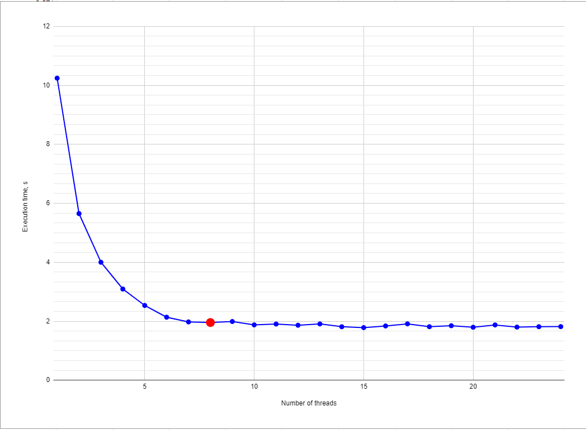

#  Parallelization using pthread API 
## Description
Some program can be speed up using multiple threads of execution. A good example of this speed up can be a calculation of integral using the [Monte Carlo method](https://en.wikipedia.org/wiki/Monte_Carlo_method "Link to wikipedia"). 

This method in this project used to find a integral of non-negative monotonically increasing functions.

## Approach to measure
Util **time** can measure real execution time.   
The **run.sh** script used to run this utility 5 times for each number of threads (1 - 24).

## Results 
**WARNING:** this results cannot be considered reliable, because it is tested on the virtual machine (VMware workstation Pro, Arch Linux, kernel version 5.19.6). For more reliable results please run this test on your own system on real machine.

As you can see, the "plateou" start from 8 threads. This is an amount of logical core in my processor (Intel i7-1165G7).
